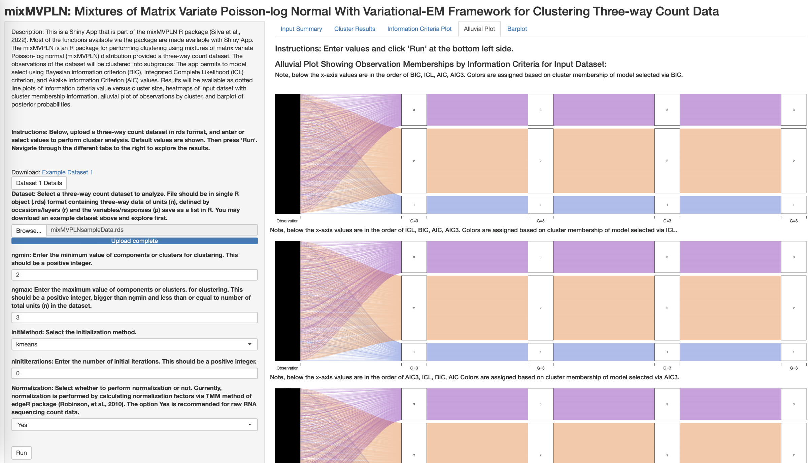

<!-- README.md is generated from README.Rmd. Please edit that file -->

# mixMVPLN

Finite Mixtures of Matrix Variate Poisson-log Normal Model for
Clustering Three-way Count Data

<!-- badges: start -->
<!-- https://www.codefactor.io/repository/github/anjalisilva/mixmvpln/issues -->
<!-- [](https://www.codefactor.io/repository/github/anjalisilva/mixmvpln)-->

[](https://github.com/anjalisilva/mixMVPLN/issues)
[](./LICENSE)


<!-- https://shields.io/category/license -->
<!-- badges: end -->

## Description

`mixMVPLN` is an R package for performing model-based clustering of
three-way count data using finite mixtures of matrix variate Poisson-log
normal (mixMVPLN) distributions ([Silva et al.,
2023](https://academic.oup.com/bioinformatics/advance-article/doi/10.1093/bioinformatics/btad167/7108770?login=false)).
Three different frameworks are available for parameter estimation of the
mixMVPLN models: 1) method based on Markov chain Monte Carlo
expectation-maximization algorithm (MCMC-EM), 2) method based on
variational Gaussian approximations (VGAs), and 3) a hybrid approach
that combines both the variational approximation-based approach and
MCMC-EM-based approach. Information criteria (AIC, BIC, AIC3 and ICL)
are used for model selection. Also included are functions for simulating
data from mixMVPLN model and visualization of clustered results.

## Installation

To install the latest version of the package:

``` r
require("devtools")
devtools::install_github("anjalisilva/mixMVPLN", build_vignettes = TRUE)
library("mixMVPLN")
```

To run the Shiny app:

``` r
mixMVPLN::runmixMVPLN()
```

## Overview

To list all functions available in the package:

``` r
ls("package:mixMVPLN")
```

`mixMVPLN` contains 5 functions:

1.  ***mvplnDataGenerator*** for the purpose of generating simulation
    data via mixMVPLN
2.  ***mvplnMCMCclus*** for clustering of count data using mixMVPLN via
    method based on MCMC-EM with parallelization
3.  ***mvplnVGAclus*** for clustering of count data using mixMVPLN via
    method based on VGAs
4.  ***mvplnHybriDclus*** for clustering of count data using mixMVPLN
    via the hybrid approach that combines both the VGAs and
    MCMC-EM-based approach
5.  ***mvplnVisualize*** for visualization of clustering results as a
    barplot of probabilities

An overview of the package is illustrated below:

<div style="text-align:center">


<div style="text-align:left">

<div style="text-align:left">

<div style="text-align:left">


## Details

### Introduction

Two-way data is defined by units (the rows) and variables/responses (the
columns). However, three-way data is defined by occasions/layers (r), in
addition to the units (n) and the variables/responses (p). For two-way
data, each observation is represented as a vector, while for three-way
data, each observation can be regarded as a matrix. The matrix variate
distributions offer a natural way for modeling three-way data.
Extensions of matrix variate distributions in the context of mixture
models have given rise to mixtures of matrix variate
distributions,mwhich have been used to cluster three-way data

The multivariate Poisson-log normal (MPLN) distribution was proposed in
1989 ([Aitchison and Ho,
1989](https://www.jstor.org/stable/2336624?seq=1)). A multivariate
Poisson-log normal mixture model for clustering of discrete/count data
was proposed by [Silva et al.,
2019](https://pubmed.ncbi.nlm.nih.gov/31311497/). Here, this work is
extended. The MPLN distribution was extended in the three-way context
to, first, propose the matrix variate Poisson-log normal (MVPLN)
distribution for three-way count data. The MVPLN distributions can
account for both the correlations between variables (p) and the
correlations between occasions (r), as two different covariance matrices
are used for the two modes. Next, the MVPLN distribution was extended in
the mixture context and resulted the mixtures of matrix variate
Poisson-log normal (mixMVPLN) distributions for clustering three-way
count data as presented in [Silva et al.,
2023](https://academic.oup.com/bioinformatics/advance-article/doi/10.1093/bioinformatics/btad167/7108770?login=false).

Three different frameworks for parameter estimation for the mixtures of
MVPLN models are proposed: one based on Markov chain Monte Carlo
expectation-maximization (MCMC-EM) algorithm, one based on variational
Gaussian approximations (VGAs), and third based on a hybrid approach
that combines VGAs with MCMC-EM.

### MCMC-EM Framework for Parameter Estimation

The MCMC-EM algorithm via Stan is used for parameter estimation. This
method is employed in the function *mvplnMCMCclus*. Coarse grain
parallelization is employed, such that when a range of
components/clusters (g = 1,…,G) are considered, each component/cluster
is run on a different processor. This can be performed because each
component/cluster size is independent from another. All
components/clusters in the range to be tested have been parallelized to
run on a seperate core using the *parallel* R package. The number of
cores used for clustering is can be user-specified or calculated using
*parallel::detectCores() - 1*. To check the convergence of MCMC chains,
the potential scale reduction factor and the effective number of samples
are used. The Heidelberger and Welch’s convergence diagnostic
(Heidelberger and Welch, 1983) is used to check the convergence of the
MCMC-EM algorithm.

### Variational-EM Framework for Parameter Estimation

MCMC-EM-based approach is computationally intensive; hence, we also
provide a computationally efficient variational approximation framework
for parameter estimation. This method is employed in the function
*mvplnVGAclus*. Variational approximations (Wainwright et al., 2008) are
approximate inference techniques in which a computationally convenient
approximating density is used in place of a more complex but ‘true’
posterior density. The approximating density is obtained by minimizing
the Kullback-Leibler (KL) divergence between the true and the
approximating densities. A variational Gaussian approximations (VGAs) is
used for parameter estimation, initially proposed for MPLN framework by
[Subedi and Browne, 2020](https://doi.org/10.1002/sta4.310). The VGAs
approach is computationally efficient, however, it does not guarantee an
exact posterior (Ghahramani and Beal, 1999).

### Hybrid Appraoch for Parameter Estimation

A hybrid approach was proposed that combines the MCMC-EM-based approach
and the VGAs. The hybrid approach comes with a substantial reduction in
computational overhead compared to a traditional MCMC-EM but it can
generate samples from the exact posterior distribution. This method is
employed in the function *mvplnHybriDclus*. The method is as follows:
first clustering based on VGAs is performed. Using the parameter
estimates from VGAs results as the initial values for the parameters and
using the classification results, next MCMC-EM is carried out to obtain
the final estimates of the model parameters.

## Model Selection and Other Details

Four model selection criteria are offered, which include the Akaike
information criterion (AIC; Akaike, 1973), the Bayesian information
criterion (BIC; Schwarz, 1978), a variation of the AIC used by Bozdogan
(1994) called AIC3, and the integrated completed likelihood (ICL;
Biernacki et al., 2000).

Starting values (argument: *initMethod*) and the number of iterations
for each chain (argument: *nInitIterations*) play an important role to
the successful operation of this algorithm. There maybe issues with
singularity, in which case altering starting values or initialization
method may help.

Clustering results could be visualized as a barplot of probabilities.

## Shiny App

The Shiny app employing hybrid approach (that combines the MCMC-EM-based
approach and the VGAs) could be run and results could be visualized:

``` r
mixMVPLN::runmixMVPLN()
```

<div style="text-align:center">



<div style="text-align:left">

## Tutorials

For tutorials, refer to the vignette:

``` r
browseVignettes("mixMVPLN")
```

- A Tour of mixMVPLN: Parameter Estimation via MCMC-EM

- A Tour of mixMVPLN With Parameter Estimation via VGA

- A Tour of mixMVPLN With Parameter Estimation via Hybrid Approach

## Citation for Package

``` r
citation("mixMVPLN")
```

Silva, A., X. Qin, S. J. Rothstein, P. D. McNicholas, and S. Subedi
(2023). Finite mixtures of matrix-variate Poisson-log normal
distributions for three-way count data. *Bioinformatics*.

``` r
A BibTeX entry for LaTeX users is

  @Article{,
    title = {Finite mixtures of matrix-variate Poisson-log normal distributions for three-way count data},
    author = {A. Silva and X. Qin and S. J. Rothstein and P. D. McNicholas and S. Subedi},
    journal = {Bioinformatics},
    year = {2023},
    volume = {},
    number = {},
    pages = {},
    url = {https://academic.oup.com/bioinformatics/advance-article/doi/10.1093/bioinformatics/btad167/7108770?login=false},
  }
```

## Package References

- [Silva, A., X. Qin, S. J. Rothstein, P. D. McNicholas, and S. Subedi
  (2023). Finite mixtures of matrix-variate Poisson-log normal
  distributions for three-way count data.
  *Bioinformatics*.](https://academic.oup.com/bioinformatics/advance-article/doi/10.1093/bioinformatics/btad167/7108770)

## Other References

- [Aitchison, J. and C. H. Ho (1989). The multivariate Poisson-log
  normal distribution.
  *Biometrika.*](https://www.jstor.org/stable/2336624?seq=1)

- [Akaike, H. (1973). Information theory and an extension of the maximum
  likelihood principle. In *Second International Symposium on
  Information Theory*, New York, NY, USA, pp. 267–281. Springer
  Verlag.](https://link.springer.com/chapter/10.1007/978-1-4612-1694-0_15)

- [Biernacki, C., G. Celeux, and G. Govaert (2000). Assessing a mixture
  model for clustering with the integrated classification likelihood.
  *IEEE Transactions on Pattern Analysis and Machine Intelligence*
  22.](https://hal.inria.fr/inria-00073163/document)

- [Bozdogan, H. (1994). Mixture-model cluster analysis using model
  selection criteria and a new informational measure of complexity. In
  *Proceedings of the First US/Japan Conference on the Frontiers of
  Statistical Modeling: An Informational Approach: Volume 2 Multivariate
  Statistical Modeling*, pp. 69–113. Dordrecht: Springer
  Netherlands.](https://link.springer.com/chapter/10.1007/978-94-011-0800-3_3)

- [Ghahramani, Z. and Beal, M. (1999). Variational inference for
  bayesian mixtures of factor analysers. *Advances in neural information
  processing systems*
  12.](https://cse.buffalo.edu/faculty/mbeal/papers/nips99.pdf)

- [Robinson, M.D., and Oshlack, A. (2010). A scaling normalization
  method for differential expression analysis of RNA-seq data. *Genome
  Biology* 11,
  R25.](https://genomebiology.biomedcentral.com/articles/10.1186/gb-2010-11-3-r25)

- [Schwarz, G. (1978). Estimating the dimension of a model. *The Annals
  of Statistics* 6.](https://www.jstor.org/stable/2958889?seq=1)

- [Silva, A., S. J. Rothstein, P. D. McNicholas, and S. Subedi (2019). A
  multivariate Poisson-log normal mixture model for clustering
  transcriptome sequencing data. *BMC
  Bioinformatics.*](https://pubmed.ncbi.nlm.nih.gov/31311497/)

- [Wainwright, M. J. and Jordan, M. I. (2008). Graphical models,
  exponential families, and variational inference. *Foundations and
  Trends® in Machine Learning*
  1.](https://onlinelibrary.wiley.com/doi/abs/10.1002/sta4.310)

## Maintainer

- Anjali Silva (<anjali@alumni.uoguelph.ca>).

## Contributions

`mixMVPLN` welcomes issues, enhancement requests, and other
contributions. To submit an issue, use the [GitHub
issues](https://github.com/anjalisilva/mixMVPLN/issues).

## Acknowledgments

- This work was initially started at University of Guelph, Ontario,
  Canada and was funded by Ontario Graduate Fellowship (Silva), Queen
  Elizabeth II Graduate Scholarship (Silva), Arthur Richmond Memorial
  Scholarship (Silva), and Discovery Grant from Natural Sciences and
  Engineering Research Council of Canada (Dang).

- Later work of Silva was conducted at the Princess Margaret Cancer
  Centre - University Health Network, Ontario, Canada and was supported
  by CIHR Postdoctoral Fellowship and resources received for
  Postgraduate Affiliation Program of Vector Institute. Later work of
  Dang was conducted at Carleton University, Ontario Canada and was
  supported by Canada Research Chair Program.

- We acknowledge Steven J. Rothstein (UGuelph), Paul D. McNicholas
  (McMasterU), Xiaoke Qin (CarletonU) and Marcelo Ponce (UToronto) for
  all their suggestions and contributions.
