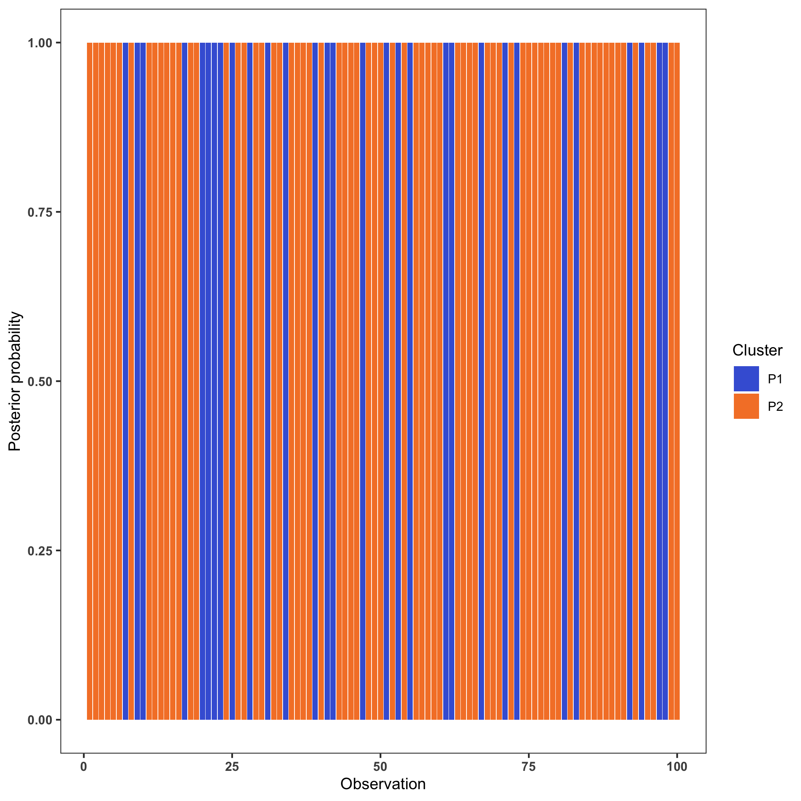
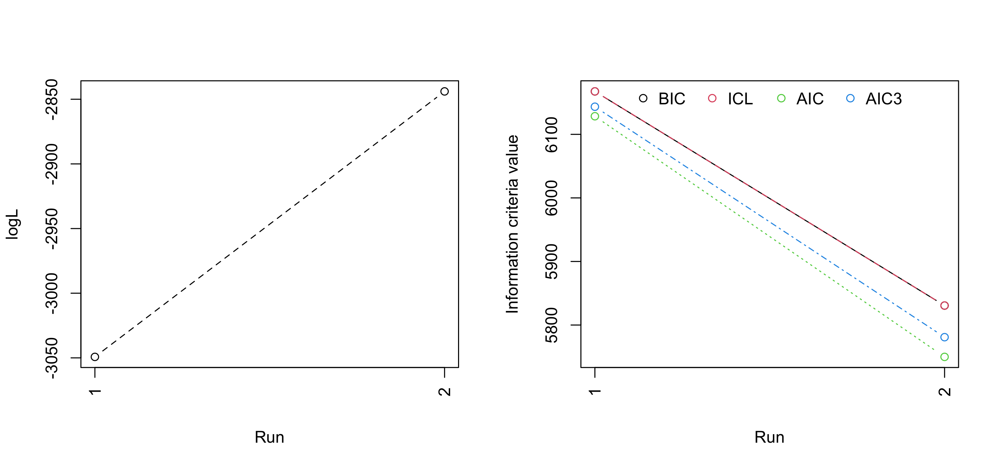

```{r setup, include=FALSE}
library(knitr)
opts_chunk$set(fig.align = "center", 
               out.width = "90%",
               fig.width = 6, fig.height = 5.5,
               dev.args=list(pointsize=10),
               par = TRUE, # needed for setting hook 
               collapse = TRUE, # collapse input & ouput code in chunks
               warning = FALSE)

knit_hooks$set(par = function(before, options, envir)
  { if(before && options$fig.show != "none") 
       par(family = "sans", mar=c(4.1,4.1,1.1,1.1), mgp=c(3,1,0), tcl=-0.5)
})
set.seed(1) # for exact reproducibility
```


## Introduction

[**mixMVPLN**](https://arxiv.org/abs/1807.08380) is an R package for model-based clustering based on mixtures of matrix variate Poisson-log normal (mixMVPLN) distributions. It is applicable for clustering of three-way count data. [**mixMVPLN**](https://arxiv.org/abs/1807.08380) provides functions for parameter estimation via three different frameworks: one based on Markov chain Monte Carlo expectation-maximization (MCMC-EM) algorithm, one based on variational Gaussian approximations (VGAs), and third based on a hybrid approach that combines VGAs with MCMC-EM. Here we will explore VGA approach. 

### Parameter Estimation via VGA

MCMC-EM-based approach is computationally intensive; hence, we also provide a computationally efficient variational approximation framework for parameter estimation. This method is employed in the function *mvplnVGAclus*. Variational approximations (Wainwright et al., 2008) are approximate inference techniques in which a computationally convenient approximating density is used in place of a more complex but 'true' posterior density. The approximating density is obtained by minimizing the Kullback-Leibler (KL) divergence between the true and the approximating densities. A variational Gaussian approximations (VGAs) is used for parameter estimation, initially proposed for MPLN framework by [Subedi and Browne, 2020](https://doi.org/10.1002/sta4.310). The VGAs approach is computationally efficient, however, it does not guarantee an exact posterior (Ghahramani and Beal, 1999). 

### Model Selection
Four model selection criteria are offered, which include the Akaike information criterion (AIC; Akaike, 1973), the Bayesian information criterion (BIC; Schwarz, 1978), a variation of the AIC used by Bozdogan (1994) called AIC3, and the integrated completed likelihood (ICL; Biernacki et al., 2000). Also included is a function for simulating data from this model. 

### Other Information
Starting values (argument: initMethod) and the number of iterations for each chain (argument: nInitIterations) play an important role to the successful operation of this algorithm. There maybe issues with singularity, in which case altering starting values or initialization method may help.

This document was written in R Markdown, using the **knitr** package for production. See `help(package = "mixMVPLN")` for further details and references provided by `citation("mixMVPLN")`. To download [**mixMVPLN**](https://arxiv.org/abs/1807.08380), use the following commands:

``` r
require("devtools")
devtools::install_github("anjalisilva/mixMVPLN", build_vignettes = TRUE)
library("mixMVPLN")
```

<br>


## Data Simulation

The function *mixMVPLN::mvplnDataGenerator()* permits to simulate data from a mixture of MVPLN distributions. See *?mvplnDataGenerator* for more information, an example, and references. To simulate a dataset from a mixture of MVPLN with 50 units, 3 total repsonses, and 2 occasions, with two mixture components, each with a mixing proportion of 0.79 and 0.21, respectively, let us use *mixMVPLN::mvplnDataGenerator()*. Here **clusterGeneration** R package is used to generate positive definite covariance matrices for illustration purposes. 

``` r
set.seed(1234) # for reproducibility, setting seed
trueG <- 2 # number of total components/clusters
truer <- 2 # number of total occasions
truep <- 3 # number of total responses
truen <- 100 # number of total units


# Mu is a r x p matrix
trueM1 <- matrix(rep(6, (truer * truep)),
                  ncol = truep,
                  nrow = truer, byrow = TRUE)

trueM2 <- matrix(rep(1, (truer * truep)),
                  ncol = truep,
                  nrow = truer,
                  byrow = TRUE)

trueMall <- rbind(trueM1, trueM2)

# Phi is a r x r matrix
# Loading needed packages for generating data
if (!require(clusterGeneration)) install.packages("clusterGeneration")
# Covariance matrix containing variances and covariances between r occasions
truePhi1 <- clusterGeneration::genPositiveDefMat("unifcorrmat",
                                                  dim = truer,
                                                  rangeVar = c(1, 1.7))$Sigma
truePhi1[1, 1] <- 1 # For identifiability issues

truePhi2 <- clusterGeneration::genPositiveDefMat("unifcorrmat",
                                                  dim = truer,
                                                  rangeVar = c(0.7, 0.7))$Sigma
truePhi2[1, 1] <- 1 # For identifiability issues
truePhiAll <- rbind(truePhi1, truePhi2)

# Omega is a p x p matrix
# Covariance matrix containing variances and covariances between p responses
trueOmega1 <- clusterGeneration::genPositiveDefMat("unifcorrmat", dim = truep,
                                 rangeVar = c(1, 1.7))$Sigma

trueOmega2 <- clusterGeneration::genPositiveDefMat("unifcorrmat", dim = truep,
                                 rangeVar = c(0.7, 0.7))$Sigma

trueOmegaAll <- rbind(trueOmega1, trueOmega2)

# Simulating data 
simulatedMVData <- mixMVPLN::mvplnDataGenerator(nOccasions = truer,
                                 nResponses = truep,
                                 nUnits = truen,
                                 mixingProportions = c(0.55, 0.45),
                                 matrixMean = trueMall,
                                 phi = truePhiAll,
                                 omega = trueOmegaAll)
```
<br>

The generated dataset can be checked:

``` r
length(simulatedMVData$dataset) # 100 units
class(simulatedMVData$dataset) # list with length of 100
typeof(simulatedMVData$dataset) # list
summary(simulatedMVData$dataset) # summary of data
dim(simulatedMVData$dataset[[1]]) # dimension of first unit is 2 x 3
                                  # 2 occasions and 3 responses
```

<br>

<div style="text-align:left">

## Clustering
<div style="text-align:left">
Once the count data is available, clustering can be performed using the *mixMVPLN::mvplnVGAclus* function. See *?mvplnVGAclus* for more information, including examples and references. Here, clustering will be performed using the above generated dataset. 

Below, clustering of *simulatedMVData$dataset* is performed for g = 1:2 with *random* initialization with 2 initialization runs. 

``` r
set.seed(1234) # for reproducibility, setting seed
clusteringResultsVGA <- mixMVPLN::mvplnVGAclus(
                                     dataset = simulatedMVData$dataset,
                                     membership = simulatedMVData$truemembership,
                                     gmin = 1,
                                     gmax = 2,
                                     initMethod = "random",
                                     nInitIterations = 2,
                                     normalize = "Yes")
```

The model selected by BIC for this dataset can be further analyzed.

``` r
clusteringResultsVGA$BICAll$BICmodelselected
# A model with 2 components/clusters is selected

# Cross tabulation of BIC selected model labels with true lables
table(clusteringResultsVGA$BICAll$BICmodelselectedLabels, simulatedMVData$truemembership)
#   1  2
#1 70  0
#2  0 30
```

## Visualize Results

Clustering results can be viewed as a barplot of probabilities. For this, select a model of interest and use *mixMVPLN::mvplnVisualize()* function from `MPLNClust` R package. 

``` r
#  Visualizing probabilities for 2 components 
                    
mvplnClustVisualsVGA <- mixMVPLN::mvplnVisualize(
                      dataset = simulatedMVData$dataset,
                      plots = 'bar',
                      probabilities = clusteringResultsVGA$allResults[[2]]$probaPost,
                      clusterMembershipVector = clusteringResultsVGA$allResults[[2]]$clusterlabels,
                      fileName = paste0('Plot_',date()),
                      printPlot = TRUE,
                      format = 'png')
                    
```



<div style="text-align:left">

The above plot illustrates, for each observation, the probability of belonging to component/cluster 1 (P1) or probability of belonging to component/cluster 2 (P2). In this example, there were 100 observations in the dataset. The bar for each observation look monotone, indicating high confidence in belonging to the indicated component/cluster. 

<br>

Log-likelihood and information criteria value at each run can be plotted as follows.
``` r
par(mfrow = c(1, 2))
graphics::matplot(clusteringResultsVGA$loglikelihood, xlab = "Run",
                  ylab = "logL", type = c("b"), pch = 1, lty = 2, xaxt="n") 
graphics::axis(1, xaxp = c(min(clusteringResultsVGA$BICAll$BICmodelselectedLabels), 
               max(clusteringResultsVGA$BICAll$BICmodelselectedLabels), 1), 
               las=2)
               
ICvalues <- matrix(c(clusteringResultsVGA$BICAll$allBICvalues,   
              clusteringResultsVGA$ICLAll$allICLvalues,
              clusteringResultsVGA$AICAll$allAICvalues,
              clusteringResultsVGA$AIC3All$allAIC3values),
              ncol=4) 
graphics::matplot(ICvalues, xlab = "Run", ylab = "Information criteria value", 
                  type = c("b"), pch = 1, col = 1:4, xaxt="n") 
graphics::axis(1, xaxp=c(min(clusteringResultsVGA$BICAll$allBICvalues), 
               max(clusteringResultsVGA$BICAll$allBICvalues), 1), 
               las=2)
graphics::legend("top", inset = c(- 0.4, 0), 
                 legend = c("BIC", "ICL", "AIC", "AIC3"), 
                 col = 1:4, pch = 1, horiz = TRUE, bty = "n")
```



<br>

<div style="text-align:left">

## References

- [Aitchison, J. and C. H. Ho (1989). The multivariate Poisson-log normal distribution. *Biometrika.*](https://www.jstor.org/stable/2336624?seq=1)

- [Akaike, H. (1973). Information theory and an extension of the maximum likelihood principle. In *Second International Symposium on Information Theory*, New York, NY, USA, pp. 267–281. Springer Verlag.](https://link.springer.com/chapter/10.1007/978-1-4612-1694-0_15)

- [Biernacki, C., G. Celeux, and G. Govaert (2000). Assessing a mixture model for clustering with the integrated classification likelihood. *IEEE Transactions on Pattern Analysis and Machine Intelligence* 22.](https://hal.inria.fr/inria-00073163/document)

- [Bozdogan, H. (1994). Mixture-model cluster analysis using model selection criteria and a new informational measure of complexity. In *Proceedings of the First US/Japan Conference on the Frontiers of Statistical Modeling: An Informational Approach: Volume 2 Multivariate Statistical Modeling*, pp. 69–113. Dordrecht: Springer Netherlands.](https://link.springer.com/chapter/10.1007/978-94-011-0800-3_3)

- [Ghahramani, Z. and Beal, M. (1999). Variational inference for bayesian mixtures of factor analysers. *Advances in neural information processing systems* 12.](https://cse.buffalo.edu/faculty/mbeal/papers/nips99.pdf)

- [Robinson, M.D., and Oshlack, A. (2010). A scaling normalization method for differential expression analysis of RNA-seq data. *Genome Biology* 11, R25.](https://genomebiology.biomedcentral.com/articles/10.1186/gb-2010-11-3-r25)

- [Schwarz, G. (1978). Estimating the dimension of a model. *The Annals of Statistics* 6.](https://www.jstor.org/stable/2958889?seq=1)

- [Silva, A., S. J. Rothstein, P. D. McNicholas, and S. Subedi (2019). A multivariate Poisson-log normal mixture model for clustering transcriptome sequencing data. *BMC Bioinformatics.*](https://pubmed.ncbi.nlm.nih.gov/31311497/)

- [Silva, A., S. J. Rothstein, P. D. McNicholas, X. Qin, and S. Subedi (2022). Finite mixtures of matrix-variate Poisson-log normal distributions for three-way count data. arXiv preprint arXiv:1807.08380.](https://arxiv.org/abs/1807.08380)

- [Wainwright, M. J. and Jordan, M. I. (2008). Graphical models, exponential families, and variational inference. *Foundations and Trends® in Machine Learning* 1.](https://onlinelibrary.wiley.com/doi/abs/10.1002/sta4.310)


----

```{r}
sessionInfo()
```


